## ShadowSocks 不完全入门指北

### 服务器端配置（Linux Ubuntu）

首先需要一台服务器（关于如何获取服务器或 VPS 的方法在最下方），这里使用的是腾讯云的服务器，假定服务器 ip 地址为：121.5.255.7（事实上并不是）

首先通过 ssh 远程登陆服务器：在命令行输入 `ssh username@serverIP`，将 `username` 替换为服务器的登陆用户名，通常是 `root`，根据不同的服务商会有所不同；`serverIP` 就是服务器的公网 IP，此处就是 `121.5.255.7`。所以实际上输入的指令为：`ssh root@121.5.255.7`。

之后会弹出密码输入界面，输入用户名对应的密码即可，输入密码时不会明文显示。

登陆完成后，输入指令 `sudo apt-get install shadowsocks`，下载 `shadowsocks`，如弹出是否安装的询问，输入 `y` 即可继续。

安装完成后，可以通过 `ssserver -h` 查看配置参数的具体意义，需要用到的参数，如图所示。

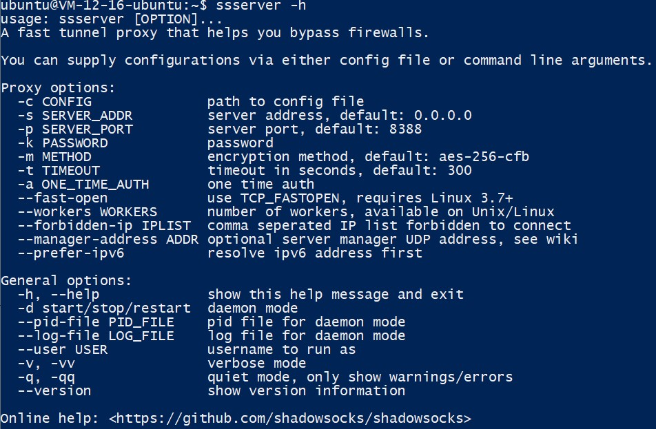

配置代理通常不需要用到上述列举的所有参数，下面是一个较为常用的指令模板：

`ssserver -p port -k password -m method --user username -d start`

将 `port` 替换为开放代理的端口号，`password` 替换为连接代理的密码，`method` 替换为代理密码的加密方式名称，`username` 替换为登录服务器的用户名，即可正常启动。`-d start` 表示后台运行，如果不需要后台运行，只要输入 `ssserver -p port -k password -m method` 即可。

实际上的指令：`ssserver -p 54434 -k testpasswd -m rc4-md5 --user root -d start`

需要注意，如果运营商有防火墙设置，需要在防火墙的设置中，将配置中的代理端口号打开，否则可能会配置失败。

另外，如果启动代理服务端程序后，发现有 `[Errno 13] Permission denied: '/var/run/shadowsocks.pid'`和`[Errno 13] Permission denied: '/var/log/shadowsocks.log'` 的报错，只需输入下面两条指令。

`sudo chown username:username /var/run/shadowsocks.pid`

`sudo chown username:username /var/log/shadowsocks.log`

将指令中的 `username` 替换为登录服务器的用户名。

实际指令：

`sudo chown root:root /var/run/shadowsocks.pid`

`sudo chown root:root /var/log/shadowsocks.log`

完成后再次尝试启动服务，如果没有报错，即为成功，如图所示。

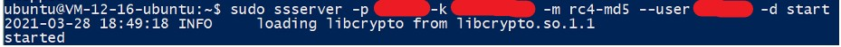

到此为止，服务器端的配置就已经全部结束了，接下来是客户端的配置。


### 客户端

#### Windows

下载[Windows 客户端](https://github.com/shadowsocks/shadowsocks-windows/releases/download/4.4.0.0/Shadowsocks-4.4.0.185.zip)，并解压缩文件夹，打开 `Shadowsocks.exe` 文件，可以看到如图界面

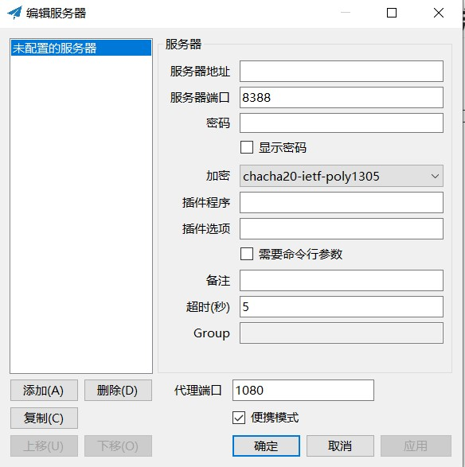

将刚才配置好的一系列参数填入，只需填写服务器地址，服务器端口，密码，加密四项即可，其他不用修改。服务器地址为服务器的公网 IP，服务器端口为刚才设置的代理端口，加密方式通过下拉框选择。配置完成之后点击`应用`或`确定`按钮。

右键桌面右下角的小飞机图标，如图所示，颜色可能与图片不同。

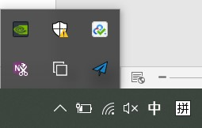

`系统代理`选择全局模式，`服务器`选择刚才配置的服务器，如果不另外设置，名称应是`服务器 IP:端口号`

打开浏览器，搜索 `ip`，查询自己的外网 IP 地址，如果代理配置成功，应当显示为自己的服务器 IP 地址，不连接代理时，应该是本地网络的 IP 地址，如图所示。

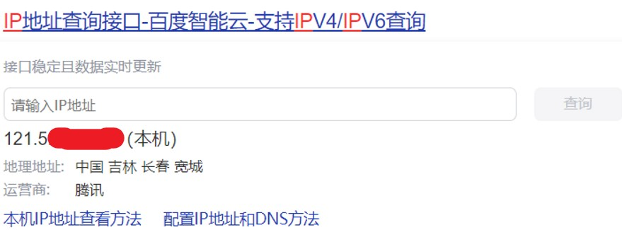

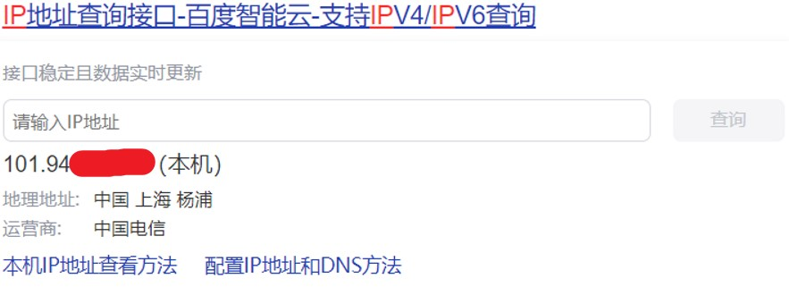


#### IOS / iPad OS

可以通过外区的苹果账号下载收费代理软件 `Shadowrocket` 或 `Quantumult`。但是我没有办法付美刀 qwq，所以我选择了免费的 `Potatso Lite`。

下载完成后打开，看到主界面。点击右上角的加号，选择手动导入，并进行配置，只需要填写 Host，Port，Encryption，Password 即可，不需要修改其他项目。


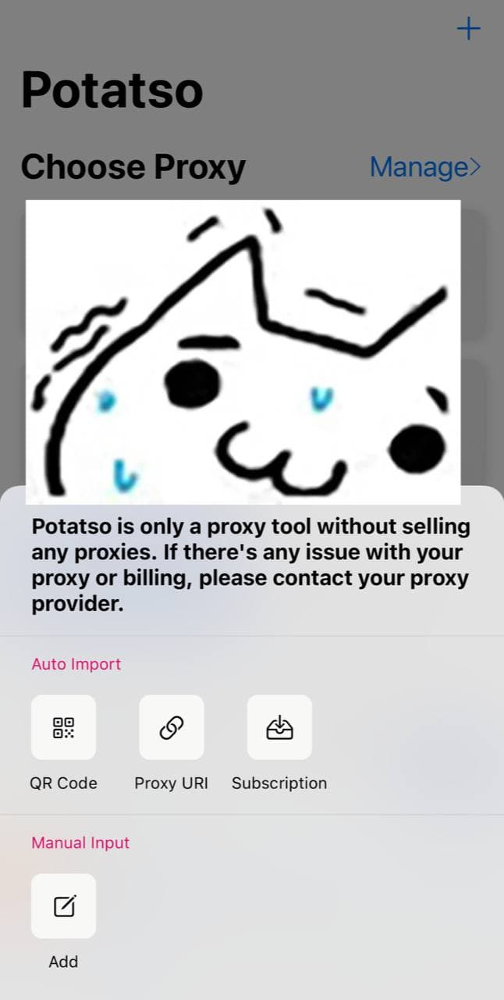

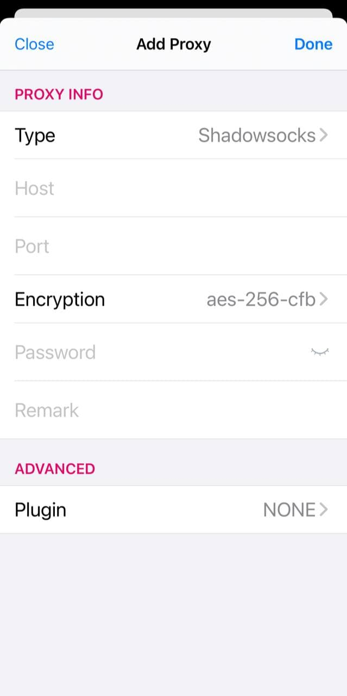

完成配置后，回到主界面，点击右下角的启动符号，即可启动代理服务。

进入浏览器，查询自己的 IP 地址，如为服务器地址，则为配置成功。

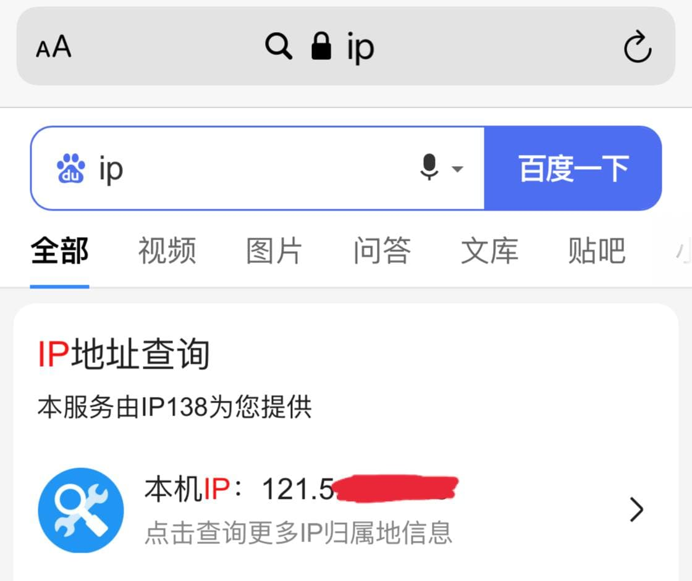


#### Android

下载 [Shadowsocks for Android](https://cdn.cuihanbing.com/app/ladder/shadowsocks-5.2.1.apk)，安装后打开，可以看到如图所示界面。

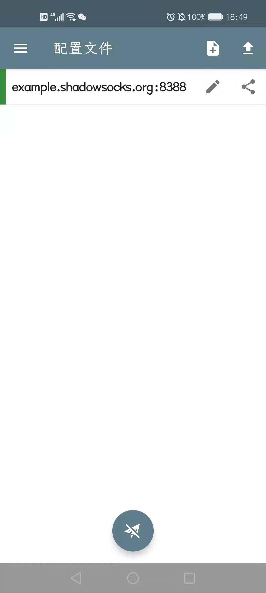

点击铅笔图标进行修改，如图所示。

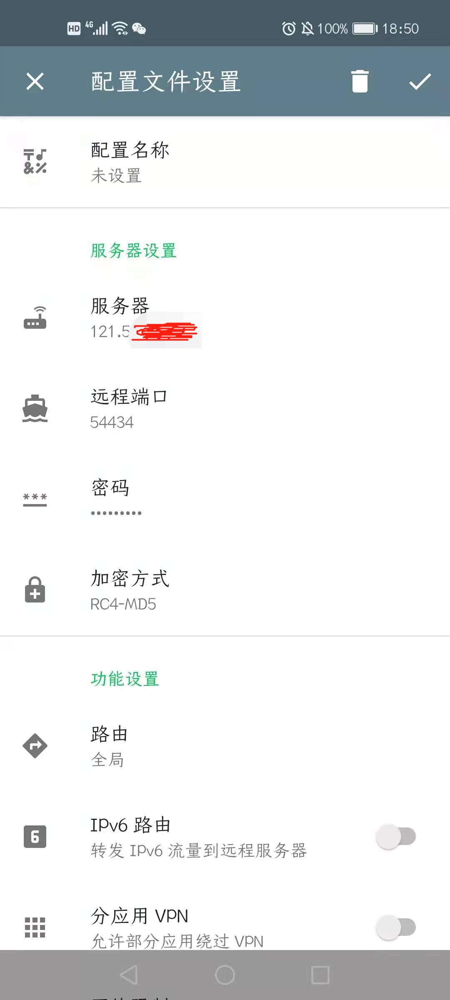

点击右上角小勾进行保存，回到主界面，点击下方小飞机按钮启动。

检查 IP 地址，如图所示。

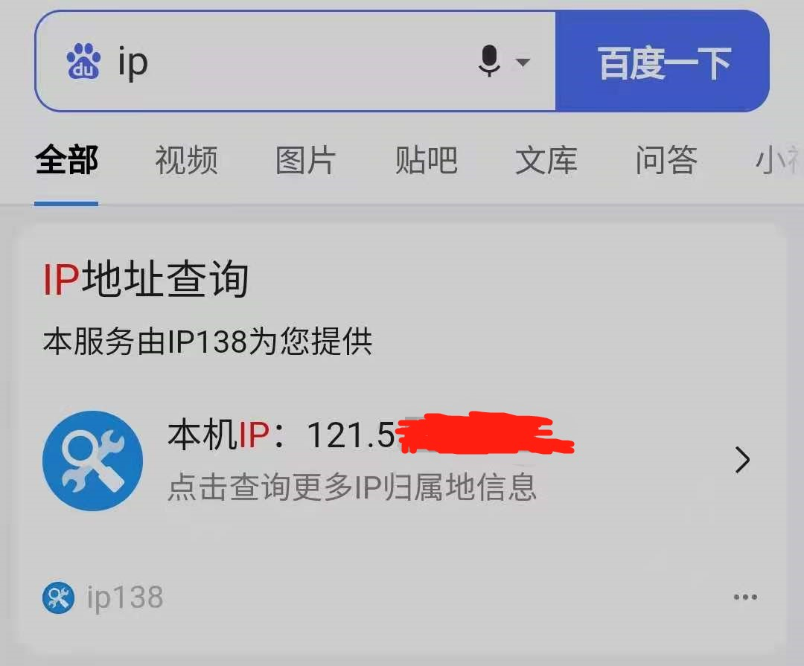


#### MacOS

MacOS 上使用的是[ClashX](src/clashX.dmg)，安装后状态栏会出现 `clashX` 的小猫图标，右键图标，打开菜单栏，如图所示。

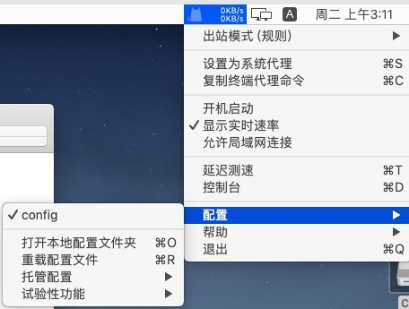

选择`配置` > `打开本地配置文件夹` > `config.yaml`，打开文件后如图所示。

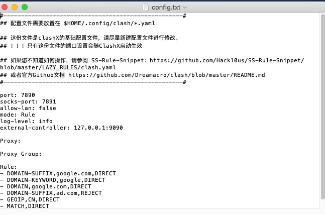

在 `Proxy:` 下方，`Proxy Group:` 上方，插入以下内容。

```
  - name: "server"
  type: ss
  server: <serverip>
  port: <port>
  password: "<password>"
  cipher: rc4-md5
```

用服务器的 IP 地址、端口和密码替换 `<serverip>`、`<port>` 和 `<password>` 即可，注意 `name` 前面的中划线，以及 `name` 和 `password` 字段需要用双引号。

保存退出，重新启动 `ClashX`，再次打开菜单栏，就可以看到多了 `GLOBAL` 选项，如图所示。

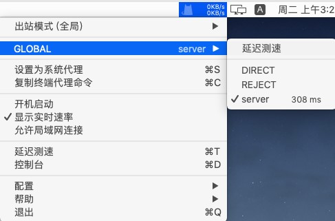

在此处选择刚刚配置好的 `server`，并将上方的`出站模式`改为全局模式，即可完成配置。查询 IP 地址的方式同上，不再演示。


### 可直连的海外 VPS 获取

 `VPS` 定义（抄自百度百科）：VPS（Virtual Private Server 虚拟专用服务器）技术，将一台服务器分割成多个虚拟专享服务器的优质服务。

所以 VPS 说到底还是个服务器……

一般搭建代理的服务器配置不需要非常高，买最低配最便宜的就可以了，这里提供一个搬瓦工的 VPS [购买链接](https://bwh81.net/aff.php?aff=044&pid=57)，有兴趣的同学也可以去[这个链接](https://www.bandwagonhost.net/4518.html)上了解更多关于配置和价格的问题。

进入购买链接后的界面如图所示。

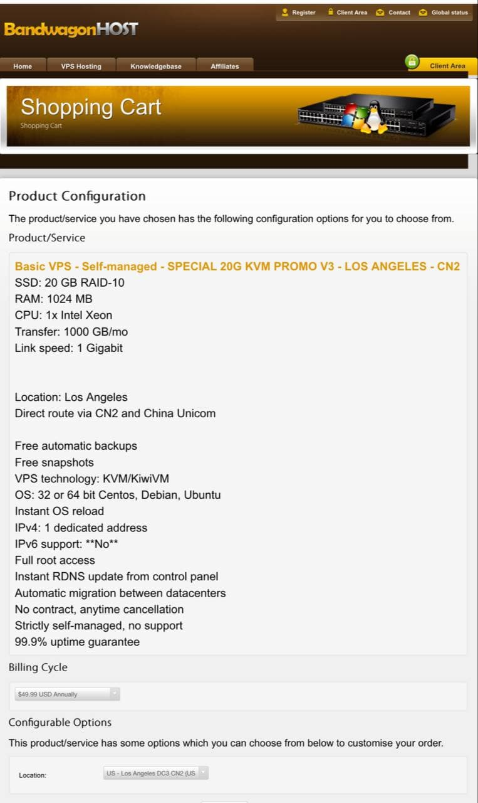

最下方有 `Add to Cart` 按钮，点击即可。

进入确认订单的界面，注意在这里可以填写一个优惠码（Promotional Code），目前折扣力度最大的优惠码是 `BWH3HYATVBJW`，填写后点击 `Validate Code`，即可看到 6.58% 的折扣，如图所示。

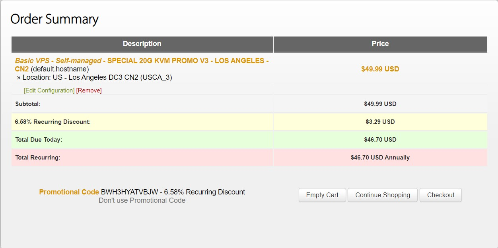

继续点击右下角 `checkout` 即可进入支付环节。此处会要求填写个人信息，如实填写即可（太过虚假的信息容易被人工审查）。支付方式选择 Alipay，同意协议，并点击 `Complete Order`，会生成一个未支付的订单。支付完成后返回会自动跳转到控制面板，如果无法成功跳转，可以访问[这个链接](http://bandwagonhost.com/clientarea.php?action=products)，选择刚才购买的 VPS 进行管理，点击最下方 `Login to KiwiVM Control Panel` 进入管理面板，如图所示。

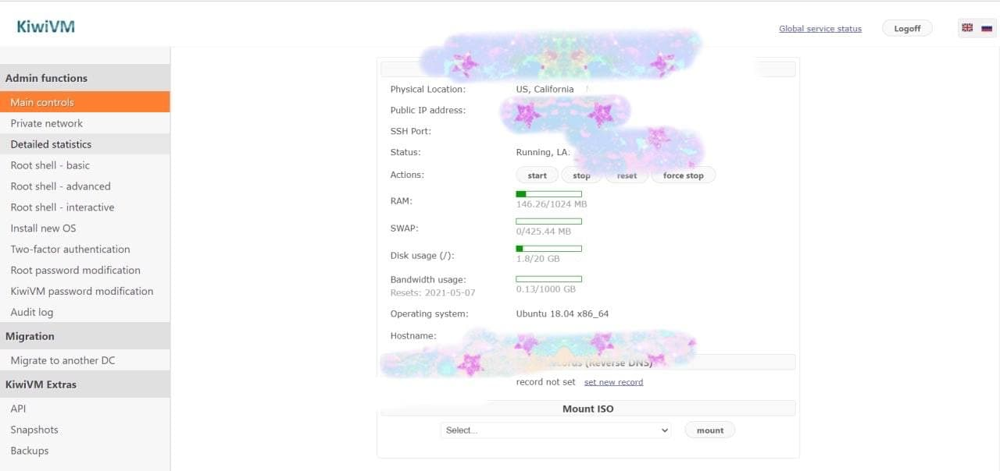

如果显示的操作系统不是 `Ubuntu`，可以在左侧选择 `Install new OS` 重装系统，root 密码也可以在左侧重置获取。

完成后打开命令行窗口，通过 ssh 远程登陆服务器就可以使用了。如果服务器的 `SSH Port` 不是 22，需要在 ssh 指令中设置 `-p` 参数，指定端口。

`ssh -p port root@serverIP`